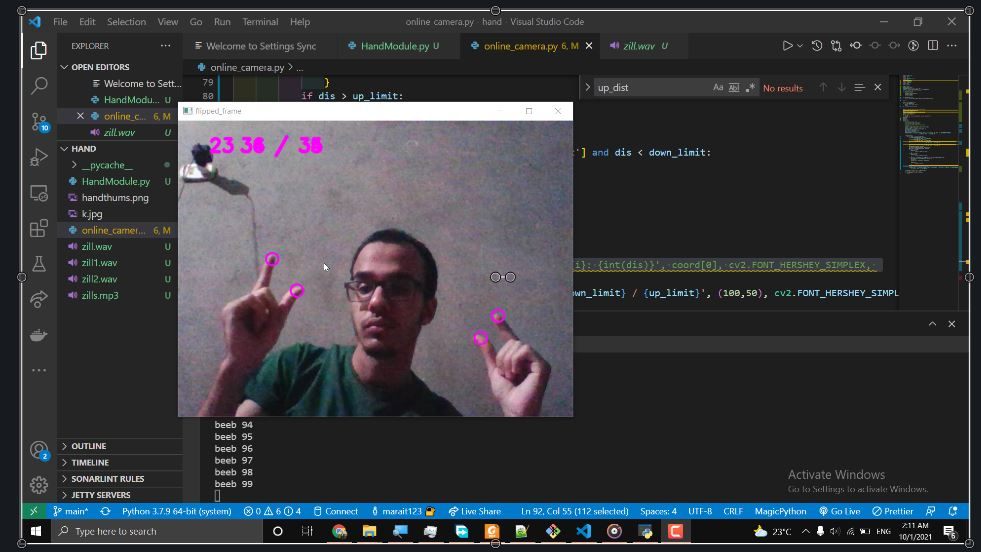
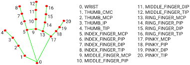

# Running
you can run the zill player with the command below after you do the setup as written inthe readme of the root folder of this repo

`python zill_player.py`
# example

# Folder Structure
|- HandsModule.py --> this includes HandModule responsible for getting the coordinates of the different parts of the hand as shown in the image below

|- zill_player.py --> this is the file that implements the zill player